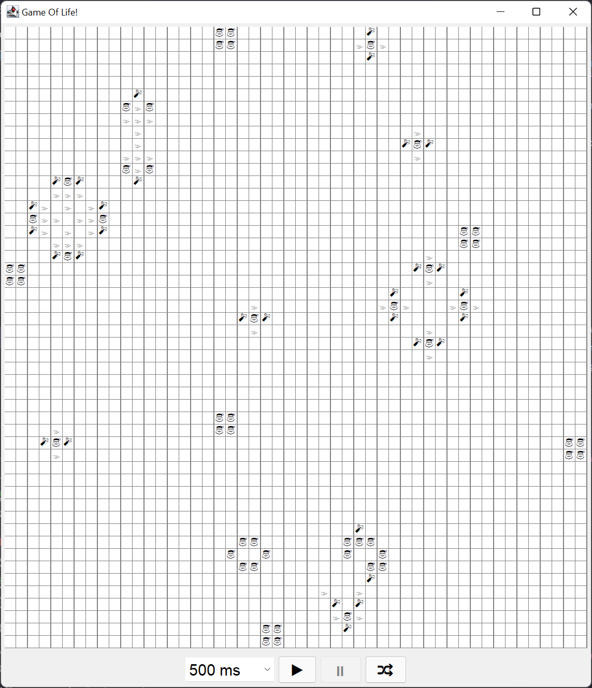

# Game Of Life
This game is an implementation of the famous game called Game Of Life. 
A description for the game can be found at https://en.wikipedia.org/wiki/Conway%27s_Game_of_Life. 
To play just build the game with maven command and start the application with java command. 

There are some improvements in this version of the Conway Game Of Life.
* New organisms (champagne bottle 🍾) are organisms that did not exist before.
* Old organisms (santa 🎅) are the organisms that have lived more than one tick. 
* Dead organisms (fog 🌫) are the organisms that were either new or old until last tick, 
but were removed due to the rule of the game.

The control below the board is as follows:
* The combobox chooses the delay between each tick.
* The ▶ button starts or continues the game.
* The ⏸ button pauses the game.
* The 🔀 (shuffle) button shuffles a new game.

## Requirements
To be able to build and run this game you have to have JDK 11 or higher 
and maven installed.