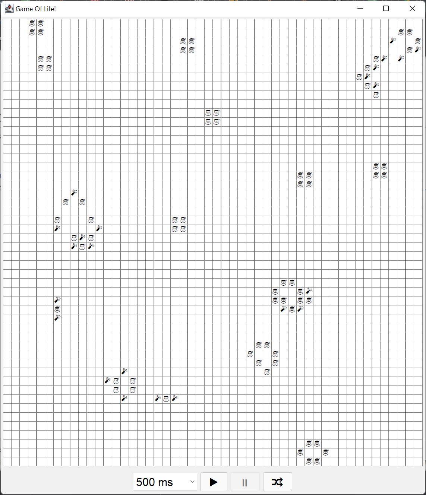

# Game Of Life
This game is an implementation of the famous game called Game Of Life. 
A description for the game can be found at https://en.wikipedia.org/wiki/Conway%27s_Game_of_Life. 
To play just build the game with maven command and start the application with java command. 

There is an improvement in this version of the Conway Game Of Life.
In this version there is a distinction between new organisms (champagne bottle 🍾)
and old organisms (santa 🎅). 

The control below the board is as follows:
* The combobox chooses the delay between each tick.
* The ▶ button starts or continues the game.
* The ⏸ button pauses the game.
* The 🔀 (shuffle) button shuffles a new game.

## Requirements
To be able to build and run this game you have to have JDK 11 or higher 
and maven installed.